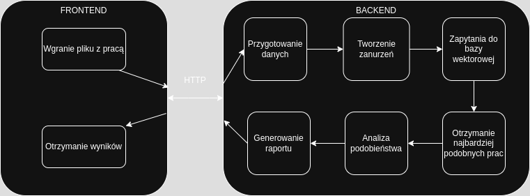
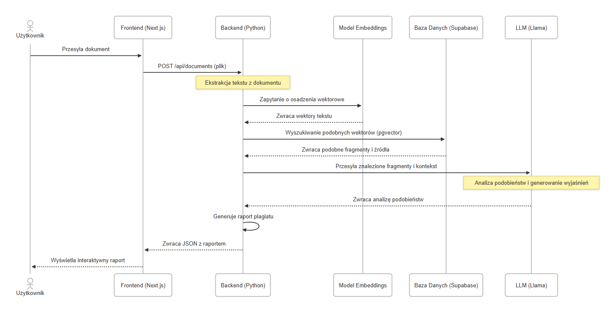
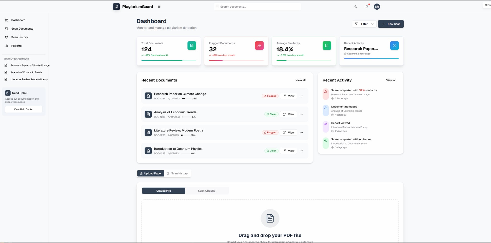
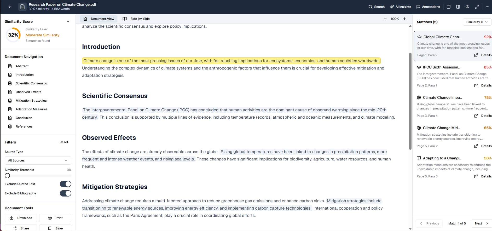
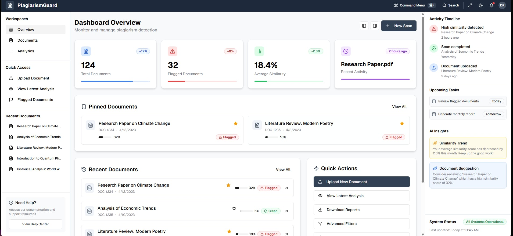
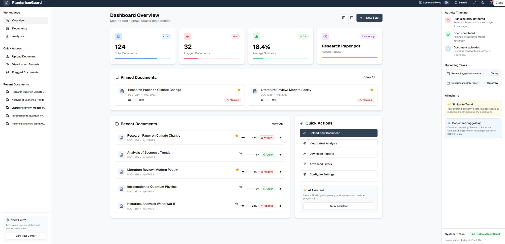

# Z04: NOWOCZESNY SYSTEM ANTYPLAGIATOWY – PlagiarismGuard ✅

---

## 📋 Spis treści 📑

1. [🚀 Workflow](#workflow)
   - [🛠️ Ogólny przepływ pracy](#ogólny-przepływ-pracy)
   - [🔄 Szczegóły sekwencji działania](#szczegóły-sekwencji-działania)
2. [💡 Design Thinking w projekcie „PlagiarismGuard”](#design-thinking-w-projekcie-plagiarismguard)
   1. [🤝 Empatyzacja: Zrozumienie użytkownika](#1-empatyzacja-zrozumienie-użytkownika)
   2. [📋 Definicja problemu](#2-definicja-problemu)
   3. [💡 Generowanie pomysłów](#3-generowanie-pomysłów)
   4. [🖌️ Prototypowanie i iteracje interfejsu](#4-prototypowanie-i-iteracje-interfejsu)
   5. [✅ Testowanie](#5-testowanie)
3. [🛠️ Zastosowane technologie](#zastosowane-technologie)
   - [🖥️ Backend](#backend)
   - [💻 Frontend](#frontend)
   - [☁️ Infrastruktura i hosting](#infrastruktura-i-hosting)
   - [🔗 Narzędzia i API](#narzędzia-i-api)

---

## 🚀 Workflow

### 🛠️ Ogólny przepływ pracy systemu

Poniżej prezentujemy schemat modularnego działania systemu antyplagiatowego **PlagiarismGuard**, umożliwiający łatwe rozbudowywanie i integrację z zewnętrznymi systemami.

1. **📤 Przesyłanie dokumentu**  
   Użytkownik (student, promotor lub administrator) przesyła dokument w formacie **PDF**, **DOCX** lub **TXT** za pomocą intuicyjnego interfejsu.

2. **🔍 Ekstrakcja tekstu**  
   System wykorzystuje biblioteki **PyPDF2** i **python-docx** do wydobycia pełnej zawartości tekstowej z załadowanego pliku.

3. **🔡 Przetwarzanie tekstu**  
   Tekst jest tokenizowany, a następnie konwertowany na wektorowe zanurzenia (embeddings) przy pomocy **SentenceTransformers** (modele BERT/SBERT), co pozwala na analizę semantyczną.

4. **🗄️ Porównanie z bazą danych**  
   Uzyskane wektory są wyszukiwane w bazie **PostgreSQL** z rozszerzeniem **pgvector**, przy użyciu narzędzia **FAISS** do szybkiego wyznaczania najbliższych sąsiadów.

5. **📝 Generowanie raportu**  
   Model LLM (np. **GPT-4**) przetwarza wyniki porównania, tworząc czytelny raport z interpretacją wykrytych podobieństw.

6. **📊 Prezentacja wyników**  
   Raport jest wyświetlany w interfejsie użytkownika w formie wizualnej, z podświetlonymi fragmentami i bezpośrednimi odnośnikami do źródeł.

---

### 🔄 Szczegóły sekwencji działania

Poniższy diagram ilustruje krok po kroku przepływ danych i interakcje między komponentami systemu.

1. **👤 Użytkownik** przesyła plik do endpointu `/api/documents` metodą **POST**.  
2. **🌐 Frontend (Next.js)** odbiera plik i przekazuje go do backendu.  
3. **🐍 Backend (Python)**:  
   - Ekstrakcja tekstu z dokumentu.  
   - Podział tekstu na fragmenty i wysłanie do usługi **Embeddings**.  
4. **🤖 Usługa Embeddings**:  
   - Generuje wektorowe reprezentacje (embeddingi).  
   - Zwraca embeddingi do backendu.  
5. **🗄️ Baza danych (Supabase / PostgreSQL + pgvector)**:  
   - Wykonuje zapytanie FAISS, zwracając listę podobnych fragmentów i ich metadane.  
6. **🔗 Backend** wysyła fragmenty wraz z kontekstem do **modelu LLM** (np. LLaMA), który:  
   - Analizuje stopień zbliżenia semantycznego.  
   - Generuje szczegółowe wyjaśnienia i interpretacje.  
7. **🔄 Backend** formatuje końcowy raport i zwraca go w formacie JSON.  
8. **🖥️ Frontend** renderuje interaktywny raport dla użytkownika, umożliwiając porównanie oryginalnych i podejrzanych fragmentów.

> System dzięki takiemu podejściu jest skalowalny, wydajny i łatwy w utrzymaniu.

---

## 💡 Design Thinking w projekcie „PlagiarismGuard”

Implementacja metodologii Design Thinking obejmowała pięć iteracyjnych etapów, pozwalających na optymalizację UX i UI.

### 1. 🤝 Empatyzacja: Zrozumienie użytkownika

Przeprowadziliśmy wywiady i warsztaty z kluczowymi grupami użytkowników:

- **🎓 Studenci** – chcą mieć pewność, że ich prace są wolne od nieświadomego plagiatu.
- **👩‍🏫 Promotorzy** – potrzebują szybkiego, klarownego wglądu w wyniki.
- **⚙️ Administratorzy** – zarządzają bazą dokumentów i dostępami.

**Główne wyzwania:**
- Brak jasnych instrukcji interpretacji wyników.  
- Niska czytelność listy podejrzanych fragmentów.  
- Trudność w porównaniu fragmentu z oryginalnym źródłem.  
- Brak pełnego kontekstu przy ocenie podobieństwa.

### 2. 📋 Definicja problemu

Na podstawie analizy empatii określono cele projektowe:

- **Zrozumiałość raportu** dla użytkownika bez wsparcia eksperta.
- **Intuicyjna nawigacja** i minimalne potrzeby szkoleniowe.
- **Widoki side-by-side** dla łatwego porównania treści.

**Kluczowe wskaźniki sukcesu:**
- Skrócenie czasu interpretacji raportu.  
- Wzrost retencji użytkowników.  
- Pozytywne oceny w ankietach.

### 3. 💡 Generowanie pomysłów

Warsztaty zespołowe (frontend, backend, UX/UI, PO) oraz analiza konkurencji (Turnitin, Unicheck) zaowocowały:

- Makietami low-fidelity i user flows.  
- Pomysłami na panel główny z szybkim dostępem do ostatnich analiz.  
- Systemem kolorowych etykiet: 🟢 zielony (niski poziom), 🟡 żółty (średni), 🔴 czerwony (wysoki).  
- Pomysłem na wbudowany **AI Assistant** wspomagający interpretację.

### 4. 🖌️ Prototypowanie i iteracje interfejsu

Iteracyjny proces w Figma i Agile przyniósł cztery wersje prototypu:

#### Wersja 1

  
Pierwszy, prosty układ prezentował jedynie ogólne statystyki. Użytkownicy zwracali uwagę na brak kontekstu i mało intuicyjną nawigację.

---

#### Wersja 2

  
Dwukolumnowy layout, kolorowe etykiety poziomu podobieństwa oraz zakładki umożliwiające szybkie przełączanie między sekcjami.

---

#### Wersja 3

  
Dodano funkcje: przypinanie dokumentów, przegląd historii skanów, filtrowanie wyników według źródła.

---

#### Wersja 4 (Finalna)

  
Pełne porównanie tekstu (side-by-side), tryb ciemny, wyszukiwarka dokumentów, **AI Assistant**. Testy beta wykazały dużą satysfakcję użytkowników.

---

### 5. ✅ Testowanie

Przeprowadzono następujące rundy testów:

- **🔍 Testy użyteczności** ze studentami i wykładowcami.  
- **📊 Ankiety satysfakcji**.

**Wyniki:**

- 87% użytkowników uznało nowy interfejs za bardziej intuicyjny.  

**Dodane funkcje po testach:**
- 🖨️ Eksport raportów do PDF z adnotacjami.  
- 🔗 Integracja z repozytoriami CORE API i ArXiv.  
- ⚙️ Zaawansowane filtry kontekstowe dla administratorów.

---

## 🛠️ Zastosowane technologie

### 🖥️ Backend

- **Python** – główny język integrujący komponenty.  
- **Django / FastAPI** – budowa i obsługa REST API.  
- **PyPDF2 / python-docx** – parsowanie i ekstrakcja tekstu.  
- **SentenceTransformers (BERT/SBERT)** – generowanie embeddingów.  
- **FAISS** – szybkie wyszukiwanie najbliższych wektorów.  
- **LangChain** – łączenie wyników wyszukiwania wektorowego z LLM.  
- **OpenAI API (GPT-4)** – analiza i generowanie raportów.  
- **PostgreSQL + PGVector** – przechowywanie metadanych i embeddingów.  
- **Docker** – konteneryzacja aplikacji.

### 💻 Frontend

- **Next.js (React)** – budowa interfejsu użytkownika.  
- **TypeScript** – statyczne typowanie.  
- **Tailwind CSS** – stylowanie utility-first.  
- **Shadcn UI** – gotowe komponenty oparte na Radix UI.

### ☁️ Infrastruktura i hosting

- **Supabase** – zarządzana instancja PostgreSQL z pgvector, uwierzytelnianie i przechowywanie plików.  
- **Vercel** – hosting frontendu z automatycznymi wdrożeniami.  
- **VPS (Digital Ocean, AWS)** – hosting backendu i procesów AI/NLP.

### 🔗 Narzędzia i API

- **GitLab** – kontrola wersji i CI/CD.  
- **CORE API** – dostęp do otwartych publikacji naukowych.

---

*Dokumentacja projektu „PlagiarismGuard” dla Z04 – pełny opis architektury, procesu projektowego i technologii.*

