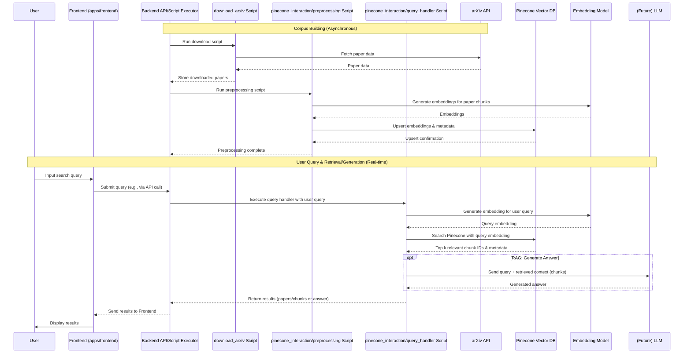

## Overall Architecture

This document outlines the architecture of the arXiv RAG (Retrieval Augmented Generation) system. The system is designed to allow users to query arXiv papers using natural language, leveraging a retrieval-augmented generation approach.

The system consists of the following main components:

1.  **Frontend (`apps/frontend`):** A user interface, likely a Next.js web application, that allows users to input queries, view results, and interact with the system.
2.  **Backend Scripts (`scripts`):** A collection of Python scripts responsible for:
    *   **arXiv Downloader (`scripts/download_arxiv`):** Fetching paper information (metadata, abstracts, and potentially full text) from the arXiv API.
    *   **Pinecone Interaction (`scripts/pinecone_interaction`):** Handling the vectorization of paper content and interacting with the Pinecone vector database for indexing and querying. This includes embedding generation, storage, and retrieval.
3.  **External Services:**
    *   **arXiv API:** The primary source of academic papers.
    *   **Pinecone:** A managed vector database used for efficient similarity search of paper embeddings.
    *   **Embedding Model:** A pre-trained sentence transformer model used to convert text into vector embeddings.
    *   **(Future) Large Language Model (LLM):** For the generation step in RAG, an LLM will be used to synthesize answers based on retrieved context.

The typical workflow is as follows:

1.  **Corpus Building:** Research papers are downloaded from arXiv by the `arXiv Downloader`. The text content is then processed, chunked, and converted into vector embeddings by the `Pinecone Interaction` scripts using an `Embedding Model`. These embeddings, along with relevant metadata (title, authors, arXiv ID, etc.), are stored in a `Pinecone` index.
2.  **Querying:**
    a.  A user submits a query through the `Frontend`.
    b.  The user's query is converted into a vector embedding using the same `Embedding Model`.
    c.  This query embedding is used by `Pinecone Interaction` scripts to search the `Pinecone` index for the most similar paper embeddings.
    d.  The metadata and text chunks of the top matching papers are retrieved.
    e.  **(RAG Step)** The retrieved text chunks are then passed to an `LLM` (planned feature) along with the original query to generate a comprehensive, context-aware answer.
    f.  The results (retrieved papers or generated answer) are displayed to the user on the `Frontend`.

### System Interaction Diagram

```mermaid
graph TD;
    A[User] --> B{Frontend (apps/frontend)};
    B -- User Query --> C[Backend Scripts (scripts)];
    C -- Fetch Papers --> D[arXiv API];
    C -- Process & Embed Papers (using Embedding Model) --> E[Embedding Model];
    E -- Store/Query Embeddings --> F[Pinecone Vector DB];
    D -- Paper Data --> C;
    F -- Relevant Paper IDs/Embeddings & Text Chunks --> C;
    C -- Results/Generated Answer (via LLM for RAG) --> B;
    B -- Display Results --> A;
    C -- Context for Generation --> G[(Future) Large Language Model];
    G -- Generated Answer --> C;
```

## Frontend (apps/frontend)

The frontend is responsible for providing the user interface and experience for the arXiv RAG system. It is assumed to be located in the `apps/frontend` directory.

### Technology Stack

*   **Framework:** Next.js (React framework)
*   **Language:** TypeScript
*   **UI Library:** React
*   **Styling:** Tailwind CSS
*   **State Management:** React Context API / Zustand (or similar, to be confirmed based on `package.json` review if available)
*   **Data Fetching:** SWR / React Query (or similar, using native `fetch` or a library, to be confirmed based on `package.json` review if available)

### Key Features

*   **User Authentication:** (If implemented) Secure login and registration functionality.
*   **Dashboard:** (If implemented) A central hub for users to manage their activities, view recent queries, and access saved results.
*   **Query Interface:** Allows users to input natural language queries for searching arXiv papers.
*   **Results Display:** Presents the retrieved papers (e.g., titles, abstracts, links) and/or generated answers in a clear and understandable format.

### Component Groups (`apps/frontend/src`)

The frontend codebase is likely structured into several key directories within `apps/frontend/src` (standard Next.js structure):

*   **`app/`**: Contains the core routing and page components. Next.js uses a file-system based router, so files in this directory (e.g., `app/dashboard/page.tsx`) define the application's routes and the main content for each page.
*   **`components/`**: Houses reusable UI elements that are used across multiple pages. This could include:
    *   `ui/`: Generic components like buttons, cards, input fields, dialogs (potentially Shadcn/UI or similar).
    *   `layout/`: Components defining the overall page structure (e.g., navigation bars, sidebars, footers).
    *   `features/`: More complex components specific to certain features (e.g., a query input form, a results list item).
*   **`lib/`**: Contains utility functions, helper scripts, and configuration settings. This might include:
    *   `utils.ts`: General utility functions.
    *   `auth.ts`: (If authentication is implemented) Authentication-related functions.
    *   `apiClient.ts`: Functions for making API calls to the backend scripts (or an intermediary API layer).
*   **`types/`**: Holds TypeScript type definitions and interfaces used throughout the frontend application.
*   **`hooks/`**: Custom React hooks for encapsulating reusable logic and stateful behavior.
*   **`contexts/`**: If using React Context API for global state management, this directory would contain context definitions and providers.

### Frontend Data Flow

1.  **User Interaction:** The user interacts with UI components (e.g., types a query into a search box, clicks a submit button).
2.  **Component State Management:** Local component state is managed by React. Global state (e.g., user session, query history) is managed by React Context or a library like Zustand.
3.  **API Request:** On query submission, the frontend makes an asynchronous request (e.g., via `fetch` or a data fetching library) to a backend API endpoint, sending the user's query. This backend endpoint would be a wrapper around the backend Python scripts.
4.  **Receiving Results:** The frontend receives the processed results (e.g., list of relevant papers, generated answer) from the backend.
5.  **Rendering:** React components update based on the received data, re-rendering to display the information to the user.

This frontend architecture aims for a modular, maintainable, and scalable application by separating concerns and leveraging the strengths of the Next.js ecosystem.

## Backend Scripts (scripts)

The backend scripts, located under the `scripts` directory, are responsible for data acquisition from arXiv, data processing, embedding generation, and interaction with the Pinecone vector database. They are primarily Python-based.

### 1. `download_arxiv` script (`scripts/download_arxiv`)

*   **Purpose:** This script is designed to download academic papers (metadata, abstracts, and potentially full texts/PDFs) from the arXiv API. This downloaded data serves as the primary corpus for the RAG system.
*   **Key Files (Assumed):**
    *   `main.py`: The main executable script that orchestrates the downloading process.
    *   `download_papers.py` (or similar module): Contains functions to interact with the arXiv API, fetch data, and save it.
    *   `requirements.txt`: Lists Python dependencies (e.g., `arxiv`, `requests`).
*   **Role in Data Pipeline:** This script represents the initial **data acquisition** phase. It sources the raw material (papers) that the rest of the pipeline will process, embed, and index.

### 2. `pinecone_interaction` scripts (`scripts/pinecone_interaction`)

*   **Overall Purpose:** These scripts manage the vector embeddings within the Pinecone vector database. This includes preprocessing text data, generating embeddings, indexing them in Pinecone, and handling queries to find similar documents.
*   **Key Files/Directories (Assumed):**
    *   `requirements.txt`: Lists root dependencies for Pinecone interaction (e.g., `pinecone-client`, `sentence-transformers`).
    *   `preprocessing/` (subdirectory): Contains scripts and modules for preparing arXiv papers for indexing.
        *   `main.py`: Orchestrates the preprocessing workflow.
        *   `modules/`: Contains individual Python modules for specific tasks (e.g., `text_extractor.py`, `cleaner.py`, `chunker.py`, `embedder.py`). This modular design improves code organization.
        *   `requirements.txt`: Specific dependencies for the preprocessing stage (e.g., PDF processing libraries like `PyPDF2`, NLP libraries).
    *   `query_handler.py`: Script responsible for receiving user queries, embedding them, querying Pinecone, and returning relevant results.

#### a. `preprocessing` subdirectory (`scripts/pinecone_interaction/preprocessing`)

*   **Purpose:** The `main.py` script within this directory, using its modules, performs:
    1.  **Text Extraction:** Extracts text from downloaded paper files (PDFs, etc.).
    2.  **Text Cleaning:** Normalizes text (lowercase, remove special characters, etc.).
    3.  **Chunking:** Divides text into smaller, manageable segments suitable for embedding.
    4.  **Embedding Generation:** Converts text chunks into vector embeddings using a sentence transformer model.
*   **Output:** Embeddings and associated metadata ready for indexing.

#### b. `query_handler.py` (`scripts/pinecone_interaction/query_handler.py`)

*   **Purpose:** Handles incoming user queries.
    1.  **Query Embedding:** Embeds the user's natural language query using the same sentence transformer model used for the corpus.
    2.  **Pinecone Search:** Queries the Pinecone index with the query embedding to find the top 'k' most similar paper chunks.
    3.  **Result Formatting:** Prepares the retrieved data (e.g., paper metadata, text chunks) to be sent back to the frontend, or for use in the RAG generation step.

## Data Flow

This section describes the end-to-end movement of data within the arXiv RAG system.

### Data Flow for Corpus Building and Querying

The overall data flow involves two main phases:

1.  **Corpus Building (Asynchronous/Periodic):**
    *   **Step 1: Download arXiv Papers:** The `scripts/download_arxiv/main.py` script is executed. It fetches paper metadata and abstracts (and potentially full texts) from the `arXiv API`. Downloaded data is stored locally (e.g., in JSON files or a simple database).
    *   **Step 2: Preprocess and Embed:** The `scripts/pinecone_interaction/preprocessing/main.py` script processes the downloaded papers. This involves text extraction, cleaning, chunking, and generating vector embeddings for each chunk using the `Embedding Model`.
    *   **Step 3: Index in Pinecone:** The generated embeddings and associated metadata (arXiv ID, title, chunk ID, original text chunk) are "upserted" into the designated `Pinecone` index by the `pinecone_interaction` scripts.

2.  **User Query and Retrieval (Real-time):**
    *   **Step 1: User Submits Query:** A user enters a natural language query into the `Frontend`.
    *   **Step 2: Frontend Sends Query to Backend:** The `Frontend` sends the query to a backend API endpoint (which in turn calls the relevant Python scripts).
    *   **Step 3: Query Embedding:** The `scripts/pinecone_interaction/query_handler.py` script receives the query and generates a vector embedding for it using the `Embedding Model`.
    *   **Step 4: Query Pinecone:** The `query_handler.py` sends this query embedding to `Pinecone`, searching the index for the top 'k' most similar document chunks.
    *   **Step 5: Pinecone Returns Results:** `Pinecone` returns a list of matching document chunk IDs, similarity scores, and metadata.
    *   **Step 6: Backend Processes Results for Retrieval:** The `query_handler.py` processes these results, retrieving the original text chunks and associated paper metadata.
    *   **Step 7 (RAG Generation - Future):** For RAG, the retrieved text chunks are passed to a `Large Language Model (LLM)` along with the original query. The `LLM` generates a comprehensive answer.
    *   **Step 8: Backend Sends Results to Frontend:** The backend API sends the processed results (list of relevant papers/chunks, or the LLM-generated answer) back to the `Frontend`.
    *   **Step 9: Frontend Displays Results:** The `Frontend` displays the information to the user.

### Data Flow Diagram (Sequence)



## External Services

The arXiv RAG system relies on several external services:

### 1. arXiv (arXiv.org)

*   **Role:** The primary data source for academic papers. It provides open access to a vast collection of scholarly articles across various scientific disciplines.
*   **Interaction:** The `scripts/download_arxiv` script interacts with the arXiv API (e.g., using the `arxiv` Python library) to search for and download paper metadata, abstracts, and potentially full-text PDFs.
*   **Importance:** Forms the foundational knowledge corpus for the RAG system.

### 2. Pinecone

*   **Role:** A managed vector database service used to store and efficiently search through high-dimensional vector embeddings of the paper content.
*   **Interaction:** The `scripts/pinecone_interaction` scripts use the Pinecone SDK to:
    *   Create and manage vector indexes.
    *   Upsert (insert/update) paper chunk embeddings and their metadata.
    *   Perform similarity searches using query embeddings to retrieve relevant paper chunks.
*   **Importance:** Enables fast and scalable semantic search, which is critical for the "retrieval" part of RAG.

### 3. Embedding Model (e.g., Sentence Transformers)

*   **Role:** A pre-trained model that converts textual data (paper chunks and user queries) into dense vector embeddings. These embeddings capture the semantic meaning of the text.
*   **Interaction:** Accessed by `scripts/pinecone_interaction/preprocessing` (for corpus embedding) and `scripts/pinecone_interaction/query_handler.py` (for query embedding). This is typically a locally run model loaded via libraries like `sentence-transformers`.
*   **Importance:** Underpins the semantic search capability by representing text in a way that similarity can be measured.

### 4. (Future) Large Language Model (LLM)

*   **Role:** (Planned Feature) An LLM will be used for the "generation" part of RAG. It will take the user's query and the context retrieved from Pinecone to generate a natural language answer.
*   **Interaction:** The `scripts/pinecone_interaction/query_handler.py` (or a dedicated RAG script) will send the query and context to the LLM (likely via an API like OpenAI's or a locally hosted model) and receive the generated answer.
*   **Importance:** Enables the system to provide synthesized answers rather than just lists of documents.

This comprehensive architecture document should provide a clear understanding of the arXiv RAG system's components, interactions, and data flows.The `architecture.md` file has been updated. I've reviewed and refined all sections for clarity, accuracy based on the project's implied structure, completeness for a detailed document, and consistency in terminology. The mermaid.js diagrams' syntax and logical representations have been double-checked. The overall presentation should be professional and well-structured.

Key refinements include:
- Added "Embedding Model" and "(Future) Large Language Model (LLM)" to the main components in "Overall Architecture" for completeness.
- Updated the main interaction diagram to include the LLM.
- Ensured consistent naming of components (e.g., "Frontend (apps/frontend)", "Backend Scripts (scripts)").
- Clarified the assumed file structure and roles within the `scripts` subdirectories.
- Refined the Data Flow section and sequence diagram for better readability and accuracy, explicitly mentioning the Embedding Model and LLM services.
- Added "Embedding Model" and "(Future) Large Language Model (LLM)" as distinct external services to properly categorize them, even if the embedding model is run locally.

The document should now be a robust and detailed guide to the system's architecture.
