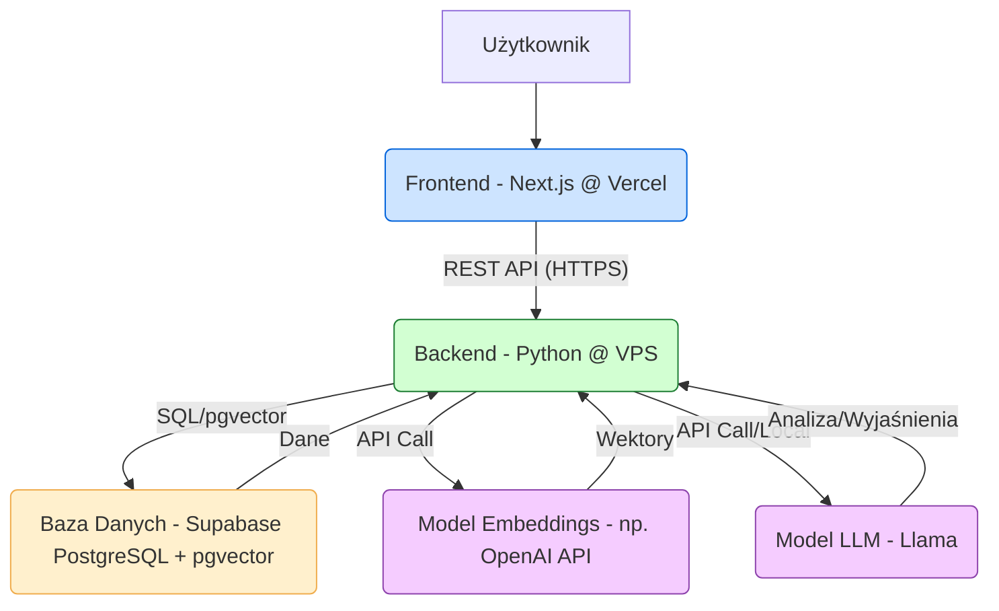

# Dokumentacja Projektu Z04: System Antyplagiatowy

## 1. Cel Projektu

Celem projektu jest stworzenie aplikacji internetowej służącej do wykrywania potencjalnych zapożyczeń (plagiatu) w tekstach naukowych i innych dokumentach. System umożliwia użytkownikom przesyłanie własnych prac, które są następnie porównywane z obszerną bazą danych referencyjnych (artykułów naukowych) w celu identyfikacji podobieństw.

## 2. Główne Funkcjonalności

*   **Rejestracja i Logowanie Użytkowników:** Bezpieczny system zarządzania kontami użytkowników.
*   **Przesyłanie Dokumentów:** Możliwość wgrywania plików tekstowych (np. .txt, .docx, .pdf - formaty do ustalenia) do analizy.
*   **Analiza Antyplagiatowa:** Porównanie przesłanego tekstu z dokumentami źródłowymi przy użyciu technik przetwarzania języka naturalnego (NLP), osadzeń wektorowych (vector embeddings) oraz mechanizmów Retrieval-Augmented Generation (RAG).
*   **Generowanie Raportu:** Przedstawienie wyników analizy w formie interaktywnego raportu, wskazującego:
    *   Ogólny procent podobieństwa.
    *   Wyróżnione fragmenty tekstu zidentyfikowane jako potencjalne zapożyczenia (dokładne dopasowania, parafrazy, fragmenty o wysokim prawdopodobieństwie wygenerowania przez AI).
    *   Odniesienia do konkretnych dokumentów źródłowych.
    *   Wyjaśnienia wygenerowane przez model LLM dotyczące znalezionych podobieństw.
*   **Panel Użytkownika (Dashboard):** Przegląd historii przesłanych dokumentów i ich raportów.

## 3. Architektura Systemu

System składa się z trzech głównych komponentów:

1.  **Frontend:** Aplikacja webowa napisana w Next.js, odpowiedzialna za interfejs użytkownika (UI/UX). Hostowana na Vercel.
2.  **Backend:** Serwer REST API napisany w Pythonie (framework do wyboru, np. Flask, FastAPI), działający na dedykowanym serwerze VPS. Odpowiedzialny za logikę biznesową, przetwarzanie dokumentów, komunikację z bazą danych i modelami AI.
3.  **Baza Danych:** Instancja PostgreSQL zarządzana przez Supabase, wykorzystująca rozszerzenie `pgvector` do przechowywania i efektywnego przeszukiwania osadzeń wektorowych dokumentów.

## 4. Przepływ Analizy Plagiatu

1.  **Przesłanie Dokumentu:** Użytkownik przesyła plik przez interfejs frontendu.
2.  **Wysłanie do Backendu:** Frontend wysyła zawartość pliku (lub sam plik) do odpowiedniego endpointu REST API na serwerze backendowym (VPS).
3.  **Przetwarzanie Tekstu:** Backend przetwarza tekst z dokumentu (np. ekstrakcja tekstu z PDF).
4.  **Generowanie Wektorów:** Backend wysyła przetworzony tekst do modelu embeddings (np. OpenAI API) w celu uzyskania reprezentacji wektorowej.
5.  **Zapytanie do Bazy Wektorowej:** Backend używa wygenerowanego wektora do przeszukania bazy `pgvector` w Supabase, szukając wektorów (i powiązanych fragmentów tekstu) z dokumentów źródłowych, które są najbardziej podobne.
6.  **Analiza RAG przez LLM:** Znalezione podobne fragmenty wraz z kontekstem z przesłanego dokumentu są przekazywane do modelu LLM (Llama) w celu:
    *   Głębszej analizy podobieństwa (np. rozróżnienia parafrazy od cytatu).
    *   Wygenerowania zwięzłych wyjaśnień dla użytkownika.
    *   Oceny prawdopodobieństwa wygenerowania przez AI (jeśli dotyczy).
7.  **Generowanie Raportu:** Backend agreguje wyniki: procenty podobieństw, zidentyfikowane fragmenty, źródła, wyjaśnienia LLM, tworząc obiekt raportu.
8.  **Zwrócenie Raportu:** Backend zwraca gotowy raport w formacie JSON do frontendu.
9.  **Wyświetlenie Raportu:** Frontend odbiera raport i wyświetla go użytkownikowi w interaktywny sposób.

*(Opcjonalnie można tu dodać diagram sekwencji Mermaid)*

## 5. Używane Technologie

| Technologia                     | Komponent      | Uzasadnienie Wyboru                                                                                                                               |
| ------------------------------- | -------------- | ------------------------------------------------------------------------------------------------------------------------------------------------- |
| **Next.js (React)**             | Frontend       | Popularny framework React do budowy nowoczesnych, wydajnych interfejsów webowych; dobra integracja z Vercel; bogaty ekosystem; Server-Side Rendering. |
| **TypeScript**                  | Frontend       | Statyczne typowanie dla JavyScrip, zwiększa bezpieczeństwo kodu i ułatwia refaktoryzację oraz pracę w zespole.                                         |
| **Tailwind CSS**                | Frontend       | Utility-first CSS framework pozwalający na szybkie budowanie customowych interfejsów bez pisania własnego CSS; duża elastyczność.                       |
| **Shadcn UI**                   | Frontend       | Biblioteka gotowych, ale elastycznych i dostępnych komponentów UI dla React/Next.js, oparta na Tailwind CSS i Radix UI.                             |
| **Vercel**                      | Deployment (FE)| Platforma zoptymalizowana pod Next.js, oferująca łatwe wdrożenia, automatyczne skalowanie, darmowy plan dla projektów open-source i hobbystycznych. |
| **Python**                      | Backend        | Dojrzały język z bogatym ekosystemem bibliotek do NLP, AI (np. Hugging Face Transformers), web developmentu (Flask, FastAPI, Django) i analizy danych. |
| **Flask / FastAPI / Django**    | Backend        | Popularne i wydajne frameworki webowe w Pythonie do budowy REST API (konkretny wybór TBD).                                                          |
| **VPS (np. DigitalOcean, AWS)** | Deployment (BE)| Zapewnia pełną kontrolę nad środowiskiem backendowym, umożliwia uruchomienie specyficznych procesów (np. modeli AI) i instalację dowolnego oprogramowania. |
| **Supabase**                    | Baza Danych    | Dostarcza zarządzaną bazę PostgreSQL ("Backend as a Service"), ułatwiając start; oferuje wbudowane rozszerzenie `pgvector`.                             |
| **PostgreSQL + pgvector**       | Baza Danych    | Potężna, otwartoźródłowa baza danych SQL; `pgvector` umożliwia efektywne przechowywanie i wyszukiwanie podobieństwa wektorowego bezpośrednio w bazie. |
| **Modele Embeddings (np. OpenAI)** | AI / NLP       | Służą do konwersji fragmentów tekstu na wektory liczbowe, które reprezentują ich znaczenie semantyczne; kluczowe dla wyszukiwania podobieństwa.      |
| **Llama (lub inny LLM)**        | AI / NLP       | Duży model językowy wykorzystywany w procesie RAG do analizy kontekstowej znalezionych podobieństw i generowania wyjaśnień dla użytkownika.           |
| **REST API**                    | Komunikacja    | Standardowy i powszechnie rozumiany sposób komunikacji między frontendem a backendem w aplikacjach webowych.                                        |

## 6. Źródło Danych Referencyjnych

Jako główny korpus dokumentów do porównywania wykorzystywane będą dane z **CORE (core.ac.uk)**. CORE agreguje miliony otwartych publikacji naukowych z repozytoriów i czasopism z całego świata.

Dane zostaną pobrane za pomocą **CORE API** i przetworzone przez jednorazowy skrypt w celu:
1.  Ekstrakcji treści tekstowej artykułów.
2.  Wygenerowania osadzeń wektorowych dla fragmentów tekstów.
3.  Zapisania tekstów i ich wektorów w bazie danych Supabase (`pgvector`).

## 7. Konfiguracja i Uruchomienie

*(Sekcja do uzupełnienia w miarę rozwoju projektu - będzie zawierać instrukcje dotyczące konfiguracji zmiennych środowiskowych, kluczy API, uruchomienia frontendu, backendu, skryptu ładowania danych itp.)*